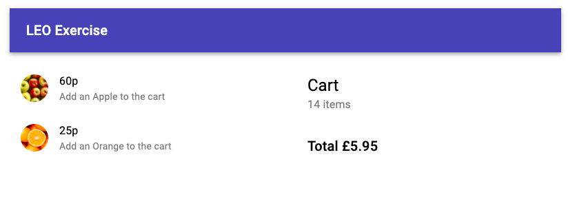
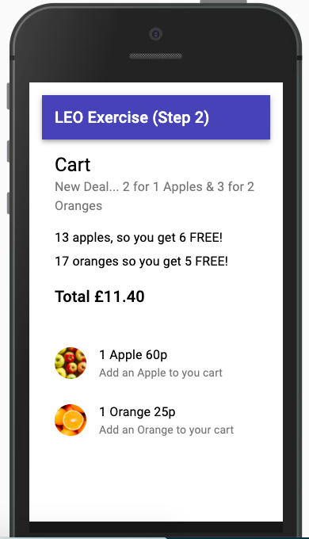

# LEO Pre-interview Exercise

> Pre-interview Exercise for Developer Candidates

- [Instructions](./public/pdf/instructions.pdf) 
- [OSM Kanban Board](https://github.com/orgs/listingslab-software/projects/14?fullscreen=true)

#### Clone, Install & Run

Clone the repository, install dependencies & start dev server. Browser will open to [localhost:3000](http://localhost:3000). Once you have setup dev you can checkout the repo at any point

```bash
cd <working-dir>
git clone https://github.com/listingslab-software/leo-exercise.git
yarn && yarn start
```

## Setting up the project

Before bootstrapping the app I consider the simplest possible solution to meet the requirement. Arguably a Shopping Cart needs something like Redux to manage state. The best and easiest to use implementation I've come across is [redux-toolkit](https://redux-toolkit.js.org). Bootstrapping React is easy with [create-react-app](https://reactjs.org/docs/create-a-new-react-app.html). If we use the template `redux-typescript`, it gives us the techstack we want; 

- React
	- TypeScript
	- Redux

The npm package runner `npx` gives us the following bash command 

```bash
# Redux + TypeScript template
npx create-react-app leo-exercise --template redux-typescript
````

## Step 1: Shopping cart 

Next job is to create an app from the template. Along the way I removed extraneous files the project doesn't need. I also added [Material UI](https://material-ui.com) to the project because we'll need some UI. Now we can concentrate on just 2 files. `Cart.tsx` which handles the frontend and `cartSlice.ts` the logic

### [Cart.tsx](./src/features/cart/Cart.tsx)

Renders the cart and handles UI interaction and updates from Redux. It's a functional component all about presentation and handles updates from the redux store quickly

```javascript

  const cart = useAppSelector(useCart)
  const { 
    totalItems,
    totalPense, 
  } = cart
  const readablePrice = `£${(Math.round(totalPense) / 100).toFixed(2)}`
  const dispatch = useAppDispatch()

  return <Button onClick={() => dispatch( addItem( 'apple' ) )} >
            Add to Cart
          </Button>

          <Typography variant={ `body1` } gutterBottom>
            { apples } apples, 
            so you get { freeApples } FREE!
          </Typography>

```

### [cartSlice.ts](./src/features/cart/cartSlice.ts)

This is the reducer etc. Here we setup the function for adding an items to the cart. We also add our transformer code here too. We transform the simple array of strings into an object called `cart` which the Cart.tsx component can more easily consume

```javascript
export const cartSlice = createSlice({
  name: 'cart',
  initialState,
  reducers: {
    addItem: (state, action: PayloadAction<string>) => {
      state.items = [...state.items, action.payload]
      // Translate into useful object
      const items = state.items
      const cart = {
        totalItems: 0,
        totalPense: 0,
      }
      for ( let i = 0; i < items.length; i ++){
        const item = items[i]
        if ( item === `apple` ) {
          cart.totalPense += 60
        }
        if ( item === `orange` ) {
          cart.totalPense += 25
        }
        cart.totalItems += 1
      }
      state.cart = { ...state.cart, ...cart }
    }
  }
})
```

 

This concludes Step 1, so we commit, push, tag and move on to Step 2

## Step 2: Deals

> New Deal... 2 for 1 Apples & 3 for 2 Oranges

If we've done Step 1 properly, this should take very little time. Basically we're going to refactor the reducer to add a bit of maths. We'll recalculate the price according to the new deals. Our approach is to work out the number of free oranges there are according to the deal rules, subtract that from number from the total oranges in the cart and multiply that new number by the price. With a good redux pattern, it's easy to consume these useful data in the React component 

 

**[cartSlice.ts](./src/features/cart/cartSlice.ts) line 26**

```javascript
export const cartSlice = createSlice({
  name: 'cart',
  initialState,
  reducers: {
    addItem: (state, action: PayloadAction<string>) => {
      state.items = [...state.items, action.payload]
      const items = state.items
      const cart = {
        totalPense: 0,
        apples: 0,
        freeApples: 0,
        oranges: 0,
        freeOranges: 0,
      }
      
      for ( let i = 0; i < items.length; i ++){
        const item = items[i]
        if ( item === `apple` ) cart.apples += 1
        if ( item === `orange` ) cart.oranges += 1
      }

      let freeApples = 0
      let numToofers = cart.apples/2
      if (numToofers >= 1 ) freeApples = Math.floor(numToofers)
      cart.freeApples = freeApples
    
      let freeOranges = 0
      let numThreefers = cart.oranges/3
      if (numThreefers >= 1 ) freeOranges = Math.floor(numThreefers)
      cart.freeOranges = freeOranges

      let totalPense = 0
      totalPense += (cart.apples - freeApples) * 60
      totalPense += (cart.oranges - freeOranges) * 60

      cart.totalPense = totalPense

      state.cart = { ...state.cart, ...cart }
    }
  }
})
```

This concludes Step 2, so we commit, push, tag and submit